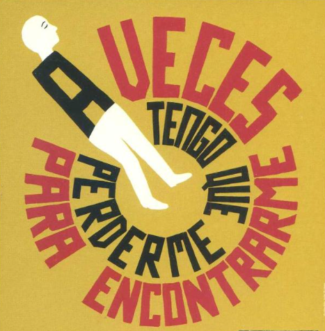

# Aiudo - Etiquetado Funnel



### Objetivo

Definir la medición del funnel de presupuesto para:

* Detectar puntos de abandono.
* Analizar combinaciones de selección.
* Optimizar la conversión a lead.
* Establecer una base escalable y mantenible (dataLayer + GTM).



### Arquitectura





### Criterios de etiquetado

* **Nomenclatura GA4**: `snake_case` y en inglés.
* **Eventos de selección**: se disparan al **confirmar** (click en “Siguiente”).
* **Datos personales (customer.\*)**: solo si hay **consentimiento** y si se decide activar **Enhanced Conversions**.
* **Parámetros no aplicables**: enviar como `undefined` (para evitar persistencias indeseadas).



### Implementación · dataLayer

#### Inicialización

```js
window.dataLayer = window.dataLayer || [];
```

#### Envío

```js
dataLayer.push({
  event: "select_user_type",
  funnel_name: "quote_calculator",
  user_type: "self"
});
```

Reglas rápidas:

* minúsculas
* sin tildes/ñ
* valores consistentes con esta guía



### Índice maestro de parámetros

> La tabla mantiene el documento legible. Las regex están en el apartado siguiente para evitar solapes en GitBook/PDF.


### Índice maestro de parámetros (con regex)

| Parámetro         |    Tipo |  Req. | Valores permitidos                           | Regex validación (string)                                       | Descripción                                    |
| ----------------- | ------: | :---: | -------------------------------------------- | --------------------------------------------------------------- | ---------------------------------------------- |
| funnel\_name      |  string |   Sí  | `quote_calculator`                           | `^quote_calculator$`                                            | Identificador del funnel                       |
| user\_type        |  string |   Sí  | `self`, `relative`                           | `^(?:self\|relative)$`                                          | Quién necesita ayuda                           |
| duration\_type    |  string |   Sí  | `temporal`, `indefinido`                     | `^(?:temporal\|indefinido)$`                                    | Duración del servicio                          |
| frequency\_type   |  string |   Sí  | `all_weeks`, `some_weeks`, `unknown`         | `^(?:all_weeks\|some_weeks\|unknown)$`                          | Frecuencia                                     |
| month\_weeks      |  number | Cond. | `1`–`4`                                      | `^[1-4]$`                                                       | Nº semanas (si `frequency_type=some_weeks`)    |
| schedule\_type    |  string |   Sí  | `unknown`, `regular`, `always`, `customized` | `^(?:unknown\|regular\|always\|customized)$`                    | Tipo de horario                                |
| care\_days        |   array |   Sí  | items: `mon`..`sun` o `["unknown"]`          | `^(?:mon\|tue\|wed\|thu\|fri\|sat\|sun\|unknown)$` _(por item)_ | Días seleccionados                             |
| care\_days\_count |  number |   Sí  | `0`–`7`                                      | `^[0-7]$`                                                       | Nº de días seleccionados                       |
| lead\_id          |  string |  Opc. | alfanumérico con `-`                         | `^[A-Za-z0-9]+(?:-[A-Za-z0-9]+)*$`                              | ID de lead (backend)                           |
| customer.email    |  string | Cond. | email válido                                 | `^[A-Za-z0-9._%+-]+@[A-Za-z0-9.-]+\.[A-Za-z]{2,}$`              | Solo con consentimiento + Enhanced Conversions |
| customer.phone    |  string | Cond. | E.164 recomendado                            | `^\+[1-9]\d{6,14}$`                                             | Solo con consentimiento + Enhanced Conversions |
| customer.cp       |  string | Cond. | CP ES recomendado                            | `^(?:0[1-9]\|[1-4]\d\|5[0-2])\d{3}$`                            | Solo con consentimiento + Enhanced Conversions |
| quote\_available  | boolean |  Opc. | `true` / `false`                             | `^(?:true\|false)$`                                             | Presupuesto visible (si aplica)                |





### Flujo del funnel


#### Paso condicional

`select_month_weeks` solo aplica cuando:

* `frequency_type = some_weeks`

Si no aplica, el flujo continúa:

* `select_care_days → select_schedule_type`



### Eventos

> Formato visual tipo “ficha”: **evento + lanzamiento + captura** y a la derecha **parámetros**.

#### view\_quote\_funnel

| Evento              | Lanzamiento                            | Captura | Parámetros    |
| ------------------- | -------------------------------------- | ------- | ------------- |
| `view_quote_funnel` | Primera carga visible del configurador |         | `funnel_name` |

***

#### begin\_quote (CTA “Calcula tu presupuesto”)

| Evento        | Lanzamiento                             | Captura | Parámetros                                    |
| ------------- | --------------------------------------- | ------- | --------------------------------------------- |
| `begin_quote` | Click en CTA que inicia el configurador |         | `funnel_name`, `button_location`, `page_type` |

Notas:

* Recomendado para medir el inicio del funnel desde home/landing.
* `button_location`: `hero`, `menu`, `footer`, etc.
* `page_type`: `landing`, `home`, etc.

***

#### select\_user\_type

| Evento             | Lanzamiento                                                | Captura | Parámetros                 |
| ------------------ | ---------------------------------------------------------- | ------- | -------------------------- |
| `select_user_type` | Click en “Siguiente” tras seleccionar quién necesita ayuda |         | `funnel_name`, `user_type` |

***

#### select\_duration\_type

| Evento                 | Lanzamiento                                    | Captura | Parámetros                     |
| ---------------------- | ---------------------------------------------- | ------- | ------------------------------ |
| `select_duration_type` | Click en “Siguiente” tras seleccionar duración |         | `funnel_name`, `duration_type` |

***

#### select\_care\_days

| Evento             | Lanzamiento                              | Captura | Parámetros                                    |
| ------------------ | ---------------------------------------- | ------- | --------------------------------------------- |
| `select_care_days` | Click en “Siguiente” tras confirmar días |         | `funnel_name`, `care_days`, `care_days_count` |

***

#### select\_month\_weeks (condicional)

| Evento               | Lanzamiento                                    | Captura | Parámetros                                     |
| -------------------- | ---------------------------------------------- | ------- | ---------------------------------------------- |
| `select_month_weeks` | Click en “Siguiente” tras confirmar frecuencia |         | `funnel_name`, `frequency_type`, `month_weeks` |

***

#### select\_schedule\_type

| Evento                 | Lanzamiento                                           | Captura                                                               | Parámetros                     |
| ---------------------- | ----------------------------------------------------- | --------------------------------------------------------------------- | ------------------------------ |
| `select_schedule_type` | Click en “Siguiente” tras seleccionar tipo de horario |  | `funnel_name`, `schedule_type` |

***


#### abrir\_formulario

| Campo                                     | Detalle                                                                |
| ----------------------------------------- | ---------------------------------------------------------------------- |
| event\_name                               | `abrir_formulario`                                                     |
| Lanzamiento | Cuando se hace click en un CTA que te abre o te lleva a un formulario. |


**Imagen de ejemplo:**

#### abrir\_formulario

| Campo                 | Detalle                                                                |
| --------------------- | ---------------------------------------------------------------------- |
| **Lanzamiento**       | Cuando se hace click en un CTA que te abre o te lleva a un formulario. |
| **Imagen de ejemplo** |                                                                        |

**Parámetros\***

| Parámetro            | Tipo   | Req. | Notas                               |
| -------------------- | ------ | :--: | ----------------------------------- |
| `id_formulario`      | string |  Sí  | Identificador del formulario        |
| `tipo_formulario`    | string |  Sí  | `lead`, `contacto`, `newsletter`    |
| `subtipo_formulario` | string | Opc. | Ej: `si`, `guia`                    |
| `nivel_formulario`   | string | Opc. | `generico`, `categoria`, `producto` |
| `event`              | string |  Sí  | Siempre `abrir_formulario`          |

<br>

**Parámetros**\*

| Parámetro            | Tipo   | Req. | Notas                         |
| -------------------- | ------ | :--: | ----------------------------- |
| `id_formulario`      | string |  Sí  | Identificador del formulario  |
| `tipo_formulario`    | string |  Sí  | lead, contacto, newsletter    |
| `subtipo_formulario` | string | Opc. | si, guia, ...                 |
| `nivel_formulario`   | string | Opc. | generico, categoria, producto |
| `event`              | string |  Sí  | `abrir_formulario`            |

**Observaciones**

* Los valores posibles de cada parámetro se consultan en el índice maestro de parámetros.

#### begin\_lead\_form

| Evento            | Lanzamiento        | Captura | Parámetros    |
| ----------------- | ------------------ | ------- | ------------- |
| `begin_lead_form` | Formulario visible |         | `funnel_name` |

***

#### generate\_lead

| Evento          | Lanzamiento                 | Captura | Parámetros                                                                                                                                             |
| --------------- | --------------------------- | ------- | ------------------------------------------------------------------------------------------------------------------------------------------------------ |
| `generate_lead` | Envío válido del formulario |         | `funnel_name`, `user_type`, `duration_type`, `frequency_type`, `month_weeks`, `schedule_type`, `care_days`, `care_days_count`, `lead_id`, `customer.*` |

Notas:

* `customer.*` solo con consentimiento + Enhanced Conversions.

***

#### view\_lead\_summary

| Evento              | Lanzamiento                           | Captura | Parámetros               |
| ------------------- | ------------------------------------- | ------- | ------------------------ |
| `view_lead_summary` | Página de gracias con resumen visible |         | `lead_id`, `funnel_name` |

***

#### view\_quote

| Evento       | Lanzamiento                                 | Captura | Parámetros                                  |
| ------------ | ------------------------------------------- | ------- | ------------------------------------------- |
| `view_quote` | Presupuesto visible en la página de gracias |         | `lead_id`, `funnel_name`, `quote_available` |



### DataLayer maestro (plantilla vacía)

> Estructura “vacía” para implementación. Los campos no aplicables deben enviarse como `undefined`.

```js
{
  event: "generate_lead",
  funnel_name: "quote_calculator",
  user_type: undefined,
  duration_type: undefined,
  frequency_type: undefined,
  month_weeks: undefined,
  schedule_type: undefined,
  care_days: undefined,
  care_days_count: undefined,
  lead_id: undefined,
  customer: {
    email: undefined,
    phone: undefined,
    cp: undefined
  },
  quote_available: undefined
}
```



### DataLayer maestro (ejemplo)

```js
{
  event: "generate_lead",
  funnel_name: "quote_calculator",
  user_type: "self",
  duration_type: "temporal",
  frequency_type: "some_weeks",
  month_weeks: 3,
  schedule_type: "regular",
  care_days: ["mon", "wed"],
  care_days_count: 2,
  lead_id: "LEAD-12345",
  customer: {
    email: "user@example.com",
    phone: "+34123456789",
    cp: "28001"
  },

  quote_available: undefined
}
```



### Gobernanza y mantenimiento

* Actualizar esta guía y la web cuando cambie el funnel, parámetros o necesidades.
* Revisiones periódicas para garantizar consistencia y calidad.


