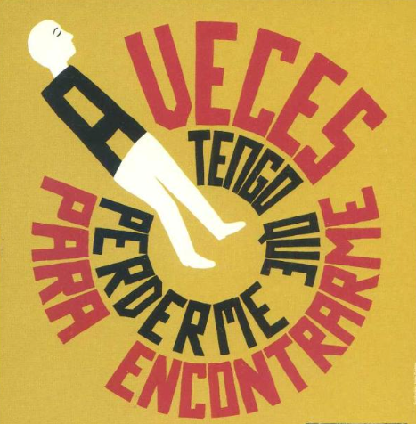

# 🥾 Lo que nos mueve

En Nosdeu, nuestros valores no son solo palabras en una página: son la forma en la que tomamos decisiones y nos relacionamos con quienes nos rodean, sirven para alinearnos entre nosotros y tenerlos escritos nos facilita este proceso.

### Sobremesas largas y los espacios de aire

Las mejores ideas rara vez nacen con prisas.\
Defendemos el valor de las **sobremesas largas**: esos momentos sin reloj en los que la conversación fluye, las ideas se cruzan y se construye desde la calma.\
A veces hay comida de por medio, otras son unas cañas o un café, pero lo importante es la actitud: sin cronómetro, sin alarma, sin agobios.\
Siempre respetando las responsabilidades y obligaciones familiares, pero sin excusas para no dedicar tiempo de calidad a pensar, escuchar y compartir lo profesional y lo NO profesional.

También creemos en el valor de lo que llamamos **espacios de aire**: encuentros, mayoritariamente por videollamada, que se alargan para hablar de todo menos de trabajo.\
Son momentos donde la agenda se aparca y la conversación se mueve libremente por ideas, anécdotas y reflexiones personales.\
Porque para que las cosas funcionen, hay que invertir tiempo en crear relaciones, y ese tiempo es la grasa que necesita nuestra máquina social para que las cosas terminen saliendo, para que surjan ideas de forma natural y para que se sienta el apoyo cuando de verdad haga falta.

En la visión tradicional de empresa, una reunión de cuatro personas durante una hora se calcula como un coste: _“esta reunión nos ha costado X euros”_.\
En Nosdeu, ese mismo tiempo es una inversión en cohesión, confianza y creatividad.\
Puede que no tenga un retorno inmediato en facturación, pero sí lo tiene en la calidad del trabajo, las ideas que nacen y la fuerza del equipo.

### La familia

No se puede hablar de lo colectivo sin hablar de la familia.\
Y "familia" no siempre significa lo mismo para todos: puede ser tu pareja, tus hijos, tu madre, un amigo que siempre está ahí...

En Nosdeu sabemos que construir algo juntos no significa olvidarse de quienes nos sostienen fuera del trabajo. La familia, en cualquiera de sus formas, es el círculo que nos da perspectiva, apoyo y sentido cuando el día a día se complica.

Habrá momentos de equilibrio y momentos de caos. Semanas en las que sobrará tiempo y otras en las que no alcanzará para todo.\
Por eso, cuidar a la familia es para nosotros un pilar fundamental, tan importante que la salud de la misma es un KPI clave a la hora de ponderar el éxito.

Porque, si no somos capaces de cuidar de los nuestros, ¿cómo vamos a cuidar de los clientes o de los proyectos?

### Persistir

Una retirada a tiempo puede ser una victoria, pero la mayoría de las cosas importantes requieren constancia.\
Sabemos que el[ cementerio de ideas, blogs, podcasts](https://www.genbeta.com/podcasting/90-podcasts-mundo-muere-su-tercer-episodio-solo-1-supera-21) y _side projects_ que no superan los tres meses es enorme, y muchas veces no por falta de recursos, sino por falta de persistencia.

Persistir no significa avanzar a lo loco, significa apoyarse en la rutina y en los hábitos que nos mantienen en marcha incluso en los días grises, cuando la motivación no aparece.\
Es seguir empujando, adaptando el rumbo cuando hace falta y dándonos el tiempo suficiente para descubrir si algo realmente funciona.

Queremos llegar lo bastante lejos como para poder decir, con certeza, “lo hemos intentado”, aunque el resultado no sea el esperado.

### Por amor al arte

Algunos de nuestros proyectos más valiosos no nacieron con un plan de negocio ni con la promesa de un retorno inmediato, sino de la pura pasión por hacer algo que nos importaba.\
Han sido esas ideas sin expectativas, hechas "por amor al arte", las que, con el tiempo, nos han regalado los aprendizajes, las conexiones y las oportunidades más inesperadas.

Hace 4 año y medio, uno de esos proyectos plantó la semilla de lo que hoy es Nosdeu, y seguimos cuidando esa forma de trabajar como un recordatorio de que no todo lo valioso se mide en euros.

Porque, si solo hiciéramos lo que tiene un retorno claro, ¿cuántas historias increíbles nos estaríamos perdiendo?

### La comunidad Datola

La comunidad Datola es una de nuestras raíces más profundas.\
En Nosdeu tenemos muy claro que va mucho más allá de las personas que forman parte del equipo organizador, sean Brais, Eva o cualquier otra.\
Pertenece a todas las personas que la han hecho crecer con su tiempo, su conocimiento y su energía.

No la usaremos como herramienta comercial ni pondremos en riesgo su sostenibilidad por intereses propios.\
Son dos proyectos distintos, unidos por la filosofía de lo colectivo y por las personas que creen que compartir hace que todos avancemos.

### Las relaciones y lo humano

Nacimos en tiempos de IA, de automatización y de revoluciones tecnológicas que avanzan a un ritmo vertiginoso. Pero tenemos claro que el futuro solo será mejor si pone a las **personas en el centro, si la tecnología potencia lo humano en lugar de desplazarlo.**

> **La buena IA no sustituye: sostiene.**\
> **No enfría: amplifica.**\
> **Lo humano no se automatiza, se potencia.**

**Las relaciones son la base de cualquier proyecto.** No se construyen solo en reuniones de trabajo, sino en las conversaciones fuera de guion, en las risas compartidas, en los gestos pequeños y en el apoyo mutuo cuando las cosas se complican.

Creemos que las herramientas pueden hacer mucho, pero son las personas las que marcan la diferencia.\
Invertir tiempo en crear y cuidar relaciones no es opcional para nosotros es la base que nos permite que las ideas crezcan, que los proyectos sobrevivan y que el trabajo tenga sentido. Porque, por muy brillante que sea una estrategia, sin confianza y sin vínculos humanos, no se ejecutan, no transcienden.

### Compartir es vivir

En Nosdeu creemos que las ideas y el conocimiento crecen cuando se comparten.\
No se trata solo de publicar o enseñar, sino de abrir procesos, mostrar aprendizajes y reconocer errores.

Compartir construye confianza, acelera el aprendizaje y deja huella más allá de un proyecto.\
No buscamos la perfección: buscamos que lo que sabemos pueda inspirar o ayudar a alguien, ahora o en el futuro.

**Porque lo que damos, vuelve.**

### Haz cosas y pasan cosas

**Nuestro mantra.** Porque cada pequeño paso abre la puerta a nuevas conexiones, aprendizajes y oportunidades que no llegarían de otra forma.\
Moverse, probar, equivocarse y volver a intentarlo es la única manera de que las cosas cambien.

### Optimismo por obligación

Días grises, lluviosos.\
FOMO por todas partes.\
Otra ola que pasa y no cogemos.\
El dinero que no llega, horas y horas invertidas en burocracia, gente pesimista alrededor...

Podríamos seguir con la lista hasta el fin de nuestros días.\
Precisamente por eso, elegimos equilibrarlo con una mirada optimista hacia el futuro, hacia la vida y hacia el presente.

Sea cual sea el golpe, buscamos siempre el lado positivo, tanto en lo profesional como en lo personal.\
No es ingenuidad, es supervivencia.\
El optimismo nos mantiene vivos, ilusionados y con energía para seguir haciendo cosas.

### No te olvides de jugar

Prueba cosas. Equivócate. Rompe las reglas y ríete un poco de las contradicciones.

En Nosdeu creemos que no todo tiene que ser serio ni seguir un plan perfecto.\
A veces, las mejores ideas aparecen cuando te sales del guion, mezclas cosas que no encajan del todo o te permites hacer algo “porque sí”.

**Juega como un niño:** con curiosidad, sin miedo al error y con la libertad de inventar tus propias reglas.\
No buscamos la rareza por la rareza, sino abrir huecos para experimentar y ver qué pasa.

Porque si todo el mundo juega con las mismas reglas, los resultados serán siempre los mismos.

<figure><figcaption></figcaption></figure>
