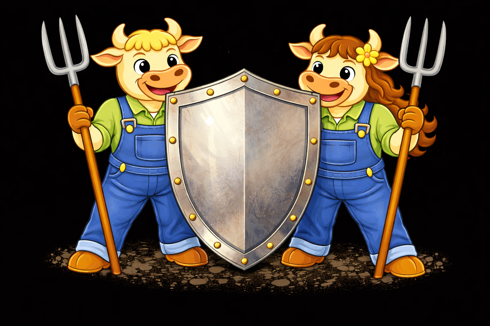
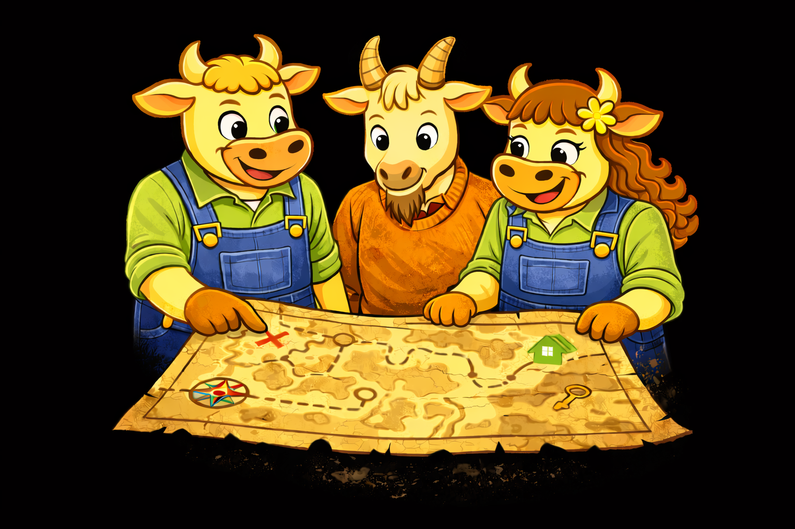

# Planes de acompañamiento

En nosDeu creemos que **los datos deben formar parte de la cultura de empresa**. Pero somos conscientes de que no todos los negocios están en el mismo nivel de madurez digital. Por eso, hemos creado unos **planes de acompañamiento** que se adaptan a cualquier situación.

Estos planes **cubre la monitorización y evolución continua de los sistemas de medición existentes**. En caso de necesitar el diseño e implementación de nuevos sistemas, se valorará en cada caso si es necesario presupuestar un proyecto adicional o si lo podemos enmarcar dentro del plan de acompañamiento establecido.



<figure><figcaption></figcaption></figure>



#### nosProtege

**Mantenimiento y tranquilidad**

Velamos de tu ecosistema de datos para que siga funcionando correctamente en el tiempo.\
Vigilancia técnica y alertas ante posibles riesgos o cambios relevantes.





#### nosCuida

**Control y visibilidad**

Además del mantenimiento técnico, hacemos seguimiento de tus KPIs principales.\
Monitorizamos cómo evoluciona el negocio y te avisamos de las desviaciones.



<figure><figcaption></figcaption></figure>





<figure><figcaption></figcaption></figure>



#### nosImpulsa

**Acción y mejora continua**

Pasamos de observar a actuar.\
Priorizamos y ejecutamos mejoras basadas en datos para generar impacto real mes a mes.





#### nosAcompaña

**Decisiones estratégicas con datos**

Te acompañamos en la toma de decisiones de medición y analítica.\
Alineamos datos, equipos y objetivos de negocio.



<figure><figcaption></figcaption></figure>





<figure><figcaption></figcaption></figure>



#### nosIntegramos

**Presencia avanzada en el día a día del proyecto**

Participamos activamente en el día a día del proyecto, aportando visión, criterio y capacidad de ejecución.\
Máximo nivel de implicación con foco en coherencia y velocidad.



<table data-header-hidden><thead><tr><th width="126.79998779296875"></th><th width="115.20001220703125"></th><th width="120"></th><th width="117.599853515625"></th><th width="139.2000732421875"></th><th width="150.00018310546875"></th></tr></thead><tbody><tr><td></td><td><strong>nosProtege</strong></td><td><strong>nosCuida</strong></td><td><strong>nosImpulsa</strong></td><td><strong>nosAcompaña</strong></td><td><strong>nosIntegramos</strong></td></tr><tr><td><strong>Objetivo principal</strong></td><td>Mantener y proteger el ecosistema</td><td>Controlar métricas y evolución</td><td>Ejecutar y mejorar con datos</td><td>Decidir estratégicamente</td><td>Ser parte del día a día</td></tr><tr><td><strong>Nivel de implicación</strong></td><td>Básico</td><td>Básico + negocio</td><td>Medio</td><td>Alto</td><td>Muy alto</td></tr><tr><td><strong>Revisión técnica</strong></td><td>✔️ Mensual</td><td>✔️ Mensual</td><td>✔️ Mensual</td><td>✔️ Continua</td><td>✔️ Continua</td></tr><tr><td><strong>Seguimiento de KPIs</strong></td><td>—</td><td>✔️ </td><td>✔️ </td><td>✔️ </td><td>✔️ </td></tr><tr><td><strong>Evolución continúa del ecosistema</strong></td><td>—</td><td>—</td><td>✔️</td><td>✔️</td><td>✔️</td></tr><tr><td><strong>Análisis específicos</strong></td><td>—</td><td>—</td><td>✔️</td><td>✔️</td><td>✔️</td></tr><tr><td><strong>Apoyo estratégico</strong></td><td>—</td><td>—</td><td>— </td><td>✔️</td><td>✔️</td></tr><tr><td><strong>Reuniones con equipos</strong></td><td>—</td><td>—</td><td>—</td><td>✔️</td><td>✔️ </td></tr><tr><td><strong>Integración en el día a día</strong></td><td>—</td><td>—</td><td>—</td><td>—</td><td>✔️</td></tr><tr><td><strong>Priorización mensual conjunta</strong></td><td>__</td><td>__</td><td>✔️</td><td>✔️</td><td>✔️</td></tr><tr><td><strong>Iniciativas activas simultáneas</strong></td><td>0</td><td>0</td><td>1</td><td>2</td><td>3</td></tr><tr><td><strong>Capacidad de adaptación</strong></td><td>Baja</td><td>Baja</td><td>Media</td><td>Alta</td><td>Máxima</td></tr><tr><td><strong>Tipo de relación</strong></td><td>Soporte</td><td>Control</td><td>Mejora continua</td><td>Partner estratégico</td><td>Operativa diaria</td></tr></tbody></table>
